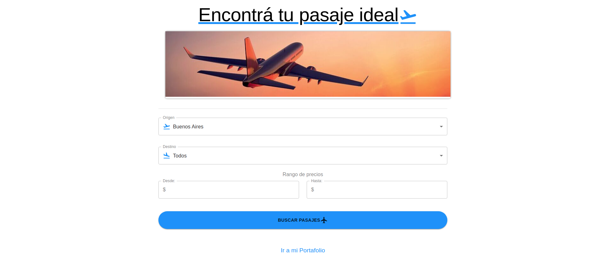

# Buscador de pasajes



## Demo online del proyecto:

- :rocket: Heroku: https://buscadorpasajes.herokuapp.com/

## Para correr en local

### 1. Clonar repo o descargar el .zip

```
$ git clone git@github.com:M-Ivan/Buscador-de-pasajes.git
$ cd "buscador pasajes"
```

### 2. MongoDB

- Local MongoDB
  -Instalalo de [aquí](https://www.mongodb.com/try/download/community)
  - Crea un .env en la carpeta raiz
  - Pega esto: MONGODB_URL=mongodb://localhost/buscadorPasajes
- Atlas Cloud MongoDB
  - Crea una DB en [https://cloud.mongodb.com](https://cloud.mongodb.com)
  - Crea un .env en la carpeta raiz
  - Pega: MONGODB_URL=mongodb+srv://tu-conexión-con-la-DB

### 3. Backend

en buscador pasajes/

```
# en la terminal
$ npm install
$ npm start (sin nodemon)
$ npm run server (nodemon)
```

### 4. Frontend

en buscador pasajes/client/

```
# en la terminal (en root folder)
$ cd client
$ npm install
$ npm start
```

### 4. Bis. Instalar backend y frontend.

```
# (en root folder)
$ npm install
$ npm run client-install
$ npm run server
$ npm run client
```

### 5. Seed de pasajes

- http://localhost:5000/api/pasajes/seed
- Carga 30 documentos en la DB.
